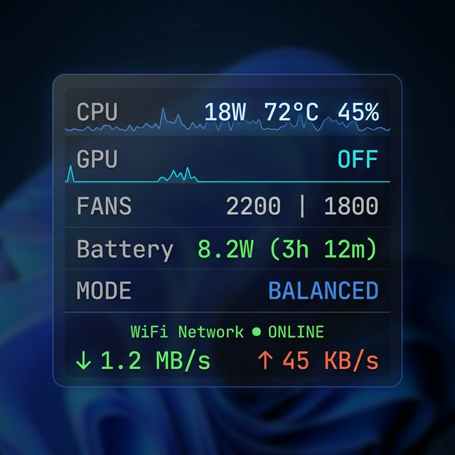

# G-Helper — Mod: Floating Monitor + Network Widget

> **Original project:** [seerge/g-helper](https://github.com/seerge/g-helper) — All core features, license and credits belong to [seerge](https://github.com/seerge).  
> This is an **unofficial fork** with additional features. Not affiliated with the original author.

---

## 📸 Preview



> *Widget shown in Balanced mode. Changes color theme automatically with performance mode.*

---

## ✨ What's New in This Mod

### 🪟 Floating Monitor Widget
A lightweight, always-on-top HUD that floats anywhere on your screen.

| Row | Info shown |
|-----|------------|
| **CPU** | Power (W) · Temperature (°C) · Usage (%) |
| **GPU** | Power (W) · Temperature (°C) · Usage (%) · shows `OFF` when idle |
| **FANS** | CPU \| GPU \| Mid fan speed in RPM |
| **Battery** | Charge/discharge rate (W) · Estimated time remaining |
| **MODE** | Current performance mode — click to cycle |
| **🌐 Network** | WiFi SSID · Online/Offline · ↓ Download · ↑ Upload speed |

### 🎨 Design Features
- **Glassmorphism** dark glass background with gradient and rounded corners
- **Theme color sync** — widget changes accent color with performance mode:
  - 🔴 **Turbo** → dark red
  - 🔵 **Balanced** → dark blue  
  - 🟢 **Silent** → dark green
- **Live sparklines** — 50-second power history graphs for CPU and GPU
- **Compact mode** — right-click widget to collapse; shows battery + network only

### 🖱️ Interactions
| Action | Result |
|--------|--------|
| **Drag** | Move widget anywhere, position saved automatically |
| **Left-click MODE row** | Cycle performance mode (Silent → Balanced → Turbo) |
| **Left-click FANS row** | Open G-Helper fan settings |
| **Right-click** | Toggle compact / full mode |

### 🌐 Network Monitor
- **WiFi SSID** and connection status
- 🟢 Green dot = online · 🔴 Red dot = offline
- **↓** Download speed in **green** (KB/s or MB/s auto-scaled)
- **↑** Upload speed in **orange** (KB/s or MB/s auto-scaled)
- Filters out virtual/VPN adapters — no random spikes
- Exponential smoothing for stable readings

### 🔧 Bug Fixes
- Fixed **fan RPM reading as 0** on ROG Flow Z13 and similar models
- Fixed **Intel TDP reading** (requires Run as Administrator)
- Fixed **widget position jumping** when dragging

---

## 🚀 How to Use

1. Download the latest build from [**Releases**](../../releases)
2. Extract the folder and run `GHelper.exe`  
   *(Run as Administrator to enable Intel TDP reading)*
3. Go to **Extra** tab → enable **Floating Monitor**
4. The widget appears in the top-right corner — drag it anywhere

---

## 🔨 Build from Source

**Requires:** .NET 8 SDK

```bash
cd app
dotnet publish GHelper.csproj -c Release -r win-x64 --self-contained false -p:PublishSingleFile=true -o publish
```

---

## 📁 Modified Files

| File | Change |
|------|--------|
| `app/UI/MonitorForm.cs` | **New** — Entire Floating Monitor widget |
| `app/Helpers/NetworkControl.cs` | **New** — WiFi SSID, online status, speed tracking |
| `app/HardwareControl.cs` | Modified — Intel TDP + NetworkControl integration |
| `app/Helpers/OSDBase.cs` | Modified — Enable mouse interaction on OSD window |
| `app/AsusACPI.cs` | Modified — Improved fan RPM reading |

---

## 📜 License & Credits

- **Original G-Helper:** [seerge/g-helper](https://github.com/seerge/g-helper) — GPL-3.0
- **This mod:** Same GPL-3.0 license applies
- Please contribute core feature improvements to the **original repo** by seerge
